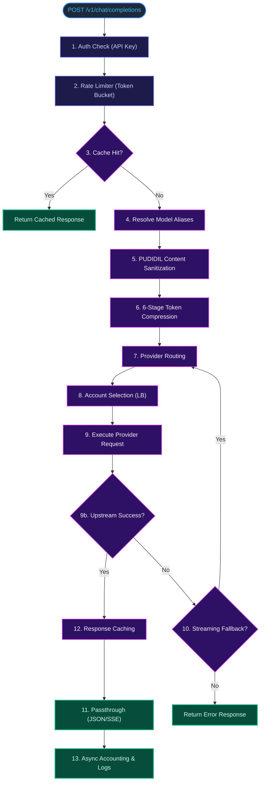
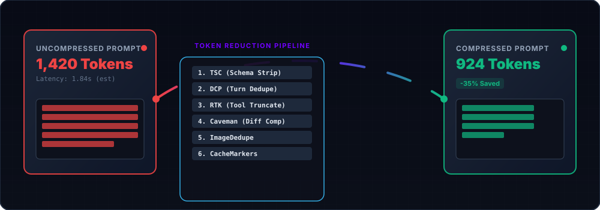
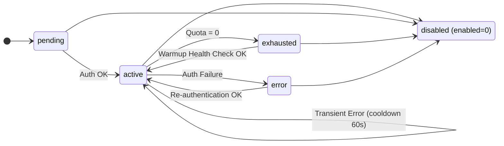

<div align="center">



<br/>

**The ultra-fast, high-efficiency AI API Proxy Pool.**

[](https://github.com/josski45/switchblade/actions/workflows/ci.yml)
[](https://golang.org)
[](LICENSE)
[](https://modernc.org/sqlite)
[](https://platform.openai.com/docs/api-reference)
[](https://golang.org)
[](#-provider-registry-90-providers)

<br/>

*Single binary. Under 20 MB RAM. OpenAI-compatible. 90+ providers. Multi-tenant. MITM proxy.*

</div>

---

## ✦ What is Switchblade?

**Switchblade** is a self-hosted AI API proxy pool written in pure Go. It sits in front of 90+ AI providers, manages a pool of accounts, compresses your tokens before sending them upstream, and exposes a single OpenAI-compatible endpoint for all your LLM clients.

Think of it as a **smart reverse-proxy** that:

- **Pools accounts** — multiple accounts per provider, round-robined and health-checked automatically
- **Compresses tokens** — 6-stage pipeline cuts prompt size by 20–40% before hitting upstream
- **Falls back gracefully** — if provider A times out, auto-route to provider B with the same model class
- **Serves multiple tenants** — tenants, users, roles, API keys with scopes, subscription tiers and usage quotas built in
- **Bills usage** — per-request token accounting, model pricing, credit ledger, and tenant balances
- **Stores images permanently** — generated images are downloaded and served locally; upstream URLs never expire
- **Proxies desktop apps** — MITM proxy with per-app handlers (Cursor, Copilot, Kiro, Antigravity)
- **Ships as one binary** — `go build`, done. No Docker required, no Python runtime for the core.

---

## 🗂️ Project Layout

```
switchblade/
├── cmd/switchblade/         # Entry point, CLI subcommands, signal handling
├── internal/
│   ├── api/                 # HTTP handlers (/api/*, /v1/*, ingress adapters)
│   ├── auth/                # LoginQueue, WarmupQueue, AutoWarmup scheduler, JWT + passwords
│   ├── billing/             # VCC auto-assign, quota admission, credit ledger
│   ├── config/              # Env var loading + defaults
│   ├── crypto/              # AES-256-GCM encryption for stored credentials
│   ├── db/                  # SQLite connection, schema (schema_v2.sql), migrations, backup
│   ├── metrics/             # Prometheus-compatible /metrics endpoint
│   ├── mitm/                # MITM proxy + per-app handlers (Cursor, Copilot, Kiro, …)
│   ├── providers/           # 90+ provider implementations
│   ├── proxy/               # Router pipeline, pool LB, filters, model map, cache
│   │   └── compression/     # 6-stage token compression pipeline
│   ├── relay/               # Relay client/server + cloudflared tunnel lifecycle
│   ├── ssrf/                # URL validation against internal/private targets
│   ├── storage/             # Local image storage
│   └── ws/                  # SSE broadcast hub (live dashboard updates)
├── web/                     # Dashboard SPA (Vite + React + Tailwind), built to web/dist
├── scripts/auth/            # OPTIONAL Python browser-login bots (not bundled — see below)
├── data/                    # Runtime data (SQLite, backups, images) — gitignored
├── docs/                    # openapi.yaml + assets
├── .env.example             # All 42 configurable env vars
├── Makefile
├── go.mod
└── go.sum
```

Tests live next to the code they cover (`*_test.go` in each package).

---

## 🚀 Quick Start

### Prerequisites

- Go 1.25+ (see `go.mod`)
- Node 22 (only to build the dashboard SPA)
- Python 3.10+ (only for optional browser-login bots)

### 1. Clone & Build

```bash
git clone https://github.com/josski45/switchblade.git
cd switchblade
make build
```

### 2. Configure

```bash
cp .env.example .env
# Edit .env — at minimum set API_KEY and ENCRYPTION_KEY
```

### 3. Run

```bash
./switchblade
# API:       http://localhost:1930
# Dashboard: http://localhost:1931   (requires `npm --prefix web ci && npm --prefix web run build` first)
```

### 4. Use it

Point any OpenAI-compatible client at `http://localhost:1930/v1`:

```bash
curl http://localhost:1930/v1/chat/completions \
  -H "Authorization: Bearer your-secret-key" \
  -H "Content-Type: application/json" \
  -d '{
    "model": "gr-llama-3-70b",
    "messages": [{"role": "user", "content": "Hello!"}],
    "stream": true
  }'
```

---

## 🔌 Provider Registry (90+ Providers)

94 providers are registered in priority order — first `OwnsModel` match wins, **Kiro is registered last as a catch-all**. The full ordered list lives in [`internal/providers/register.go`](internal/providers/register.go).

### Registration Order

```
1. BYOK                  — explicit "byok/" prefix, most specific
2. Browser-auth          — canva · codebuddy · codex · mimo · qoder
3. Major API-key         — openai · anthropic · googleai · deepseek · groq · mistral
                           cohere · together · openrouter · fireworks · perplexity · ai21 · alibaba
4. Niche API-key         — cerebras · githubmodels · cloudflareai · huggingface · sambanova
                           novita · hyperbolic · xai · zhipu · qwen · … (70+ more)
5. Kiro                  — catch-all fallback
```

### Prefix Examples

| Prefix | Provider | Auth | Notes |
|:---:|---|---|---|
| `gpt-` | OpenAI | API key | GPT-4/5 models |
| `anth-` | Anthropic | API key | Claude models |
| `ga-` | Google AI | API key | Gemini models |
| `gr-` | Groq | API key | ultra-fast inference |
| `ds-` | DeepSeek | API key | V3, Coder |
| `or-` | OpenRouter | API key | 100+ models |
| `byok/` | BYOK | Your own key | Any OpenAI-compatible endpoint |

See `OwnsModel()` in each provider under `internal/providers/` for the complete prefix rules.

### Optional Browser-Auth Bots

Providers that log in via browser (canva, qoder, …) expect a Python script per provider. **Scripts are not bundled** — Switchblade looks for `scripts/<provider>_login.py` at runtime and logs a failure if missing. See [`scripts/auth/README.md`](scripts/auth/README.md) for the exact script contract.

---

## 🧠 Request Pipeline



---

## 🗜️ Token Compression (6 Stages)

Reduces prompt size by **20–40%** before it hits the upstream provider, cutting costs and latency.

<div align="center">
  
</div>

| Stage | Name | What it does |
|:---:|---|---|
| 1 | **TSC** | Strip whitespace from JSON schemas, trim descriptions, drop `$schema`/`$defs` |
| 2 | **DCP** | Deduplicate identical content across conversation turns, keep latest |
| 3 | **RTK** | Truncate tool results in old turns, keep last N turns full |
| 4 | **Caveman** | Compress git diffs, directory trees, and repetitive structural content |
| 5 | **ImageDedupe** | Remove duplicate base64 image blocks across turns |
| 6 | **CacheMarkers** | Insert Anthropic `cache_control` at stable prefixes |

---

## 🏢 Multi-Tenancy, Tiers & Billing

- **Tenants** own users, accounts, API keys, and usage — every business table is tenant-scoped
- **Users** sign in with bcrypt-hashed passwords and receive HS256 JWTs (roles: owner, admin, developer, viewer)
- **Tiers** cap API keys, models, request rate, and daily tokens per tenant (configurable in `tier_config`)
- **Billing** records per-request token usage (`usage_records`), aggregates it (`usage_summary`), and applies model pricing against a tenant credit ledger and balance
- **VCC pool** — virtual credit cards for auto-upgrading free-tier accounts (`/api/vcc/auto-assign`)

## 🕵️ MITM Proxy

A local MITM proxy (`internal/mitm`) intercepts desktop AI apps and routes their traffic through the pool, with per-app request handlers for Cursor, Copilot, Kiro, and Antigravity. Certificates and sessions are tracked in the `mitm_certs` / `mitm_sessions` tables.

---

## 🔄 Account State Machine



- **LoginQueue** — spawns the provider's Python login script (optional, see above)
- **WarmupQueue** — API-only health check
- **AutoWarmupScheduler** — recurring timer (default 15 min), persisted in `settings` table

---

## 📡 Relay System

Expose your Switchblade pool from behind NAT using `cloudflared`:

```
RELAY_MODE=client            # this instance connects to relay server
RELAY_SERVER_URL=...         # relay server endpoint
RELAY_SECRET=your-secret     # shared secret
RELAY_PEER_NAME=home-pool    # identifier for this peer
```

**Modes:** `disabled | client | server | both` — the relay protocol is JSON over HTTP (stdlib only). **Cloudflared:** binary auto-managed, health-checked, auto-reconnect on drop.

---

## 🔑 API Reference

Full spec: [`docs/openapi.yaml`](docs/openapi.yaml).

### Core Endpoints

| Method | Path | Description |
|---|---|---|
| `POST` | `/v1/chat/completions` | OpenAI-compatible chat completions (stream + non-stream) |
| `GET` | `/v1/models` | List all available models |
| `POST` | `/v1/images/generations` | Generate images (OpenAI-compatible) |
| `GET` | `/v1/images/retrieve/{id}` | Serve stored image from local disk |

### Management API

| Method | Path | Description |
|---|---|---|
| `GET/POST/PUT/DELETE` | `/api/accounts` | Account pool CRUD |
| `GET` | `/api/stats` | Usage statistics |
| `GET` | `/api/logs` | Request logs |
| `GET/POST/PUT/DELETE` | `/api/keys` | API key management |
| `GET/POST/PUT/DELETE` | `/api/filters` | PUDIDIL content filter rules |
| `GET/POST/PUT/DELETE` | `/api/model-combos` | Fallback chain definitions |
| `GET/POST/PUT/DELETE` | `/api/vcc/cards` | Virtual credit card pool |
| `POST` | `/api/vcc/auto-assign` | Auto-assign VCC cards to accounts |
| `GET` | `/api/vcc/transactions` | VCC transaction history |
| `GET` | `/api/cache/stats` | Response cache metrics |
| `DELETE` | `/api/cache/purge` | Purge response cache |
| `GET` | `/api/export` | Export accounts/settings/filters to JSON |
| `POST` | `/api/import` | Import accounts/settings/filters from JSON |
| `POST` | `/api/replay` | Replay failed requests |
| `GET` | `/api/relay/nodes` | List relay nodes |
| `GET` | `/api/images` | List image generations |
| `GET` | `/api/images/stats` | Image storage stats |
| `DELETE` | `/api/images/{id}` | Delete generation + file |

### Observability

| Method | Path | Description |
|---|---|---|
| `GET` | `/health` | `{status, uptime, accounts_active, db_size}` |
| `GET` | `/ready` | Readiness probe (DB + accounts check) |
| `GET` | `/metrics` | Prometheus-compatible metrics |

---

## ⚙️ Configuration

All configuration is via environment variables. Copy `.env.example` and edit — it documents all 43 variables.

| Variable | Default | Description |
|---|---|---|
| `PORT` | `1930` | Main API port |
| `DASHBOARD_PORT` | `1931` | Dashboard port |
| `API_KEY` | `switchblade-secret` | Bearer token for API auth |
| `ENCRYPTION_KEY` | `...` | Key for credential encryption (AES-256-GCM) |
| `DATABASE_PATH` | `data/switchblade.db` | SQLite database path |
| `HEADLESS` | `true` | Run browser bots in headless mode |
| `RELAY_MODE` | `disabled` | `disabled \| client \| server \| both` |
| `FALLBACK_ENABLED` | `true` | Enable streaming fallback |
| `FALLBACK_MAX_ATTEMPTS` | `3` | Max fallback hops per request |
| `CACHE_ENABLED` | `true` | Enable response caching |
| `CACHE_DEFAULT_TTL_SEC` | `300` | Cache TTL in seconds |
| `RATE_LIMIT_ENABLED` | `true` | Enable per-client rate limiting |
| `RATE_LIMIT_DEFAULT` | `100` | Requests per minute per API key |
| `LOG_LEVEL` | `info` | Log verbosity: `debug \| info \| warn \| error` |
| `LOG_RETENTION_DAYS` | `30` | Auto-prune request logs after N days |
| `BACKUP_INTERVAL_MINUTES` | `60` | SQLite auto-backup interval |
| `IMAGE_RETENTION_DAYS` | `0` | Image storage retention (0 = forever) |

---

## 🗃️ Database Schema

33 tables in a single SQLite file (`data/switchblade.db`) with WAL journaling and foreign keys enforced:

- **Core**: `accounts`, `request_logs`, `usage_summary`, `settings`, `filter_rules`, `model_mappings`, `model_combos`, `custom_models`, `proxy_pool`, `response_cache`, `provider_config`, `relay_nodes`
- **Multi-tenant**: `tenants`, `users`, `api_keys`, `api_key_scopes`, `tiers`, `tier_config`, `usage_records`, `tenant_balance`, `tenant_subscriptions`, `credit_ledger`, `model_pricing`
- **VCC**: `vcc_cards`, `vcc_transactions`
- **Images**: `image_studio_chats`, `image_studio_results`
- **Relay/MITM**: `webhooks`, `webhook_logs`, `mitm_sessions`, `mitm_certs`

27 tables are defined in [`internal/db/schema_v2.sql`](internal/db/schema_v2.sql); the rest are added by idempotent forward migrations (`internal/db/migrate.go`). Migrations are **forward-only** — there is no rollback. Run:

```bash
./switchblade migrate
```

---

## 🛡️ Security

- API keys and passwords stored as **bcrypt hashes** (legacy SHA-256 hashes still verify)
- Account credentials encrypted at rest with **AES-256-GCM** using `ENCRYPTION_KEY`
- Auth via `Authorization: Bearer <key>` or `x-api-key` header
- **SSRF guard** — outbound URLs fetched by management features are validated against private/internal ranges (`internal/ssrf`)
- Structured logging via `log/slog` (text on stderr), level controlled by `LOG_LEVEL`
- CORS configured via `CORS_ORIGIN` env var
- See [SECURITY.md](SECURITY.md) for reporting vulnerabilities

---

## 🤝 Contributing

See [CONTRIBUTING.md](CONTRIBUTING.md).

---

## 📋 Changelog

See [CHANGELOG.md](CHANGELOG.md).

---

## 📄 License

MIT — see [LICENSE](LICENSE).

---

<div align="center">

**Built with ❤️ in Go · Single binary · No bullshit**

</div>
